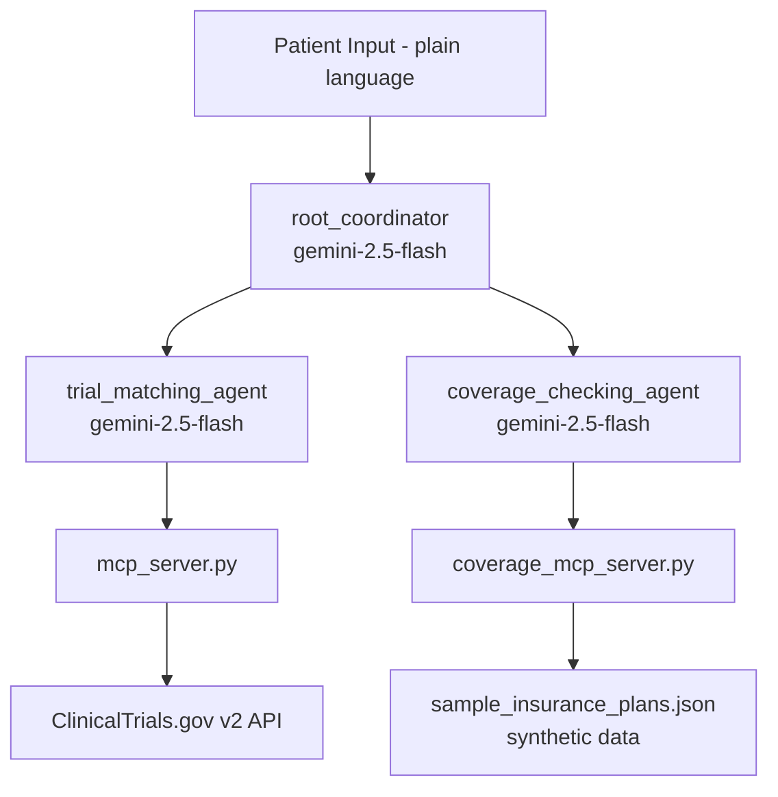

# Clinical Trial Matching Agent with Insurance Coverage Checking


## Description
A clinical trial shouldn't require a law degree and an insurance broker to find. 
Patients searching for trials face two walls: dense eligibility criteria scattered 
across public databases, and no way to know whether their insurance would cover the 
visits involved. This agent does both — it matches a patient's plain-language 
description of their condition to real trial criteria, then checks that match against 
their coverage so they walk away with a clear answer instead of a pile of paperwork 
to decode. The output is not a diagnosis but a starting point to bring to their 
provider with informed questions already in hand.

---

## Problem
Patients looking for clinical trials run into two slow, frustrating walls: eligibility 
criteria written in dense medical language scattered across public databases, and then — 
if they find a promising trial — a separate scramble of calling their insurance broker 
to find out if related visits and procedures would even be covered. Both steps eat up 
time a patient managing a serious condition doesn't have.

## Solution
The patient describes their condition in plain language. The agent matches them against 
real recruiting clinical trials from ClinicalTrials.gov, cross-checks the relevant 
procedures against their insurance plan, and returns one plain-language response — 
instead of one phone call to find a trial and another to ask if they can afford to join it.

## Value
Patients get one fast answer combining two normally separate burdens — trial eligibility 
and coverage uncertainty — without tracking down a broker or wading through 
ClinicalTrials.gov's raw criteria. They also walk away with something concrete and 
informed to bring to their provider, rather than a guess.

---

## How It Works

A patient types a plain-language description of their condition into the chat interface. 
Here's what happens from there:

1. The **root_coordinator** receives the input and decides which sub-agent to call first
2. It delegates to the **trial_matching_agent**, passing the patient's condition description
3. The trial_matching_agent calls its MCP server (`mcp_server.py`), which hits the 
   ClinicalTrials.gov v2 API and returns a list of recruiting trials matching the condition
4. Eligibility criteria are extracted from each matched trial (age range, inclusion/exclusion 
   criteria, required procedures)
5. The root_coordinator then delegates to the **coverage_checking_agent**, passing the 
   procedures those trials require alongside the patient's plan name
6. The coverage_checking_agent calls its MCP server (`coverage_mcp_server.py`), which 
   reads from a local synthetic insurance plan file and returns coverage status, 
   coverage percentage, and any prior authorization requirements
7. The root_coordinator synthesizes both sets of results into one plain-language response
8. The patient receives a single answer: which trials they may qualify for, and whether 
   their plan covers the related visits

**Example input:**
> "I have type 2 diabetes and my A1C is 8.5. I'm on metformin but it's not controlling 
> my levels well. Can you find me relevant clinical trials and check if my BasicCare 
> plan covers the related visits?"

---

## Architecture



---

## Agents

**root_coordinator**
The patient-facing agent. Receives plain-language input, delegates to both sub-agents 
using ADK's `AgentTool`, and synthesizes their results into one combined plain-language 
response. Never stores or repeats identifying patient information. Always clarifies 
that output is a starting point for a provider conversation, not medical advice.

**trial_matching_agent**
Searches ClinicalTrials.gov for recruiting trials matching the patient's condition. 
Connects to `mcp_server.py` via stdio MCP transport. Extracts eligibility criteria 
(age range, inclusion/exclusion criteria, required procedures) from matched trials 
for the coverage agent to work with.

**coverage_checking_agent**
Takes the procedures and visit types required by matched trials and checks them 
against the patient's insurance plan. Connects to `coverage_mcp_server.py` via 
stdio MCP transport. Returns what's covered, at what percentage, and whether 
prior authorization is required.

---

## MCP Servers

**mcp_server.py** — ClinicalTrials.gov wrapper
- Wraps the ClinicalTrials.gov v2 public API (no API key required)
- Exposes two tools: `search_trials_by_condition` and `get_trial_details`
- Async rate limiting at 1 QPS to respect API terms of use
- Curl-based HTTP requests to avoid TLS fingerprinting issues
- Logs to stderr to keep stdio transport channel clean

**coverage_mcp_server.py** — Insurance coverage wrapper
- Reads from local synthetic insurance plan data (`data/sample_insurance_plans.json`)
- Exposes two tools: `load_plan` and `check_coverage`
- No external API calls — purely local file I/O
- No patient data logged or persisted

Both servers run on stdio transport and are launched as subprocesses by their 
respective agents using ADK's `StdioServerParameters`.

---

## Key Concepts Demonstrated
- Multi-agent system (Google ADK)
- MCP Server (FastMCP, stdio transport)
- Security features (session-scoped memory, PII sanitization, no persistent storage)

---

## Setup Instructions

1. Clone the repository
2. Create and activate a virtual environment:
```bash
   python3 -m venv .venv
   source .venv/bin/activate
```
3. Install dependencies:
```bash
   pip3 install -r requirements.txt
```
4. Create your `.env` file in the project root (see `.env.example`); it will look like this:
GEMINI_API_KEY=your_gemini_api_key_here
GEMINI_MODEL=gemini-2.5-flash
5. Run the application:
```bash
   python3 -m app.fast_api_app
```
6. Open your browser at `http://localhost:8000`

---

## Security Notes
- Patient health information exists only within the current session via ADK's 
  `ToolContext` state dictionary — nothing is written to a database or persisted 
  between conversations
- A `_sanitize_condition()` function strips name patterns and age mentions from 
  patient input before anything reaches an external API or LLM
- All API keys loaded via `.env` and `os.getenv()` — nothing hardcoded, 
  nothing committed to version control

---

## Disclaimer
This tool is for informational purposes only and does not constitute medical, legal, 
or financial advice. Clinical trial eligibility and insurance coverage determinations 
should always be confirmed with a qualified healthcare provider and your insurance 
carrier. Do not make medical decisions based solely on this agent's output.